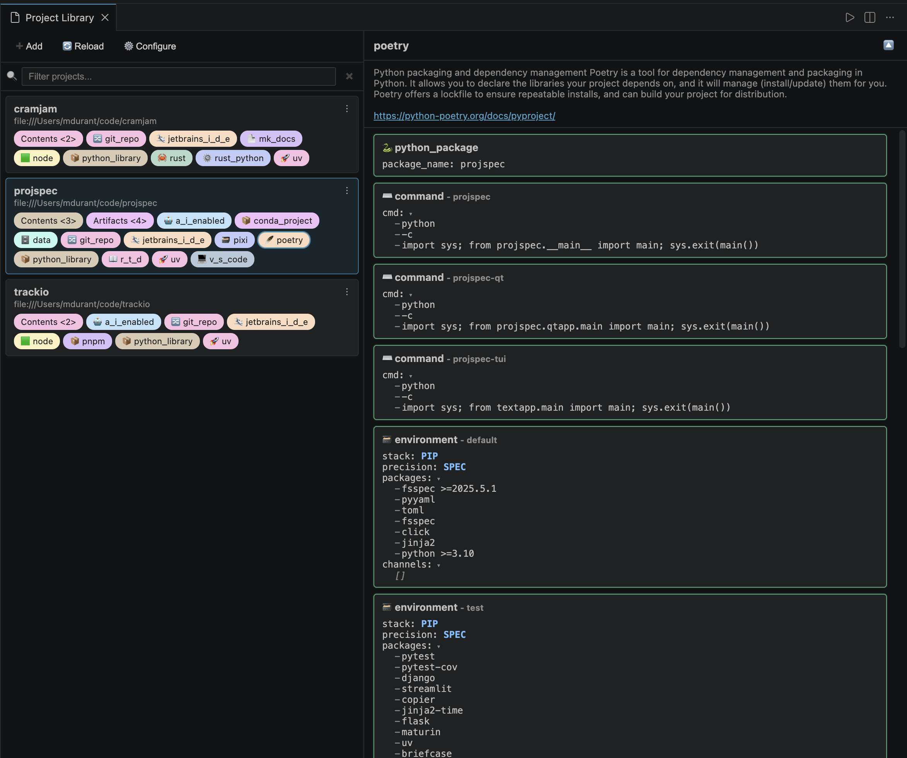

UI Support
==========

`projspec` is designed to be useful in whichever interface you are already using -
it comes to you, rather than the other way around. As well as the python
library interface (which provides full power and flexibility),
the following interactivity is supported. Of these, all but
the CLI look very similar and have the same capabilities.

CLI
---

Installing `projspec` makes the command `projspec` available. This is the same command which is called
as a subprocess by the `vscode`, `pycharm` and `anaconda-desktop` plugins. Unlike the rest of the UIs here,
this is already covered in the :ref:`quickstart`. Text feedback is given for every command and parameter

Here is the full tree of possible commands

.. code-block:: text

    projspec
        config   Interact with the projspec config.
            defaults  Show default config settings for all available values and short descriptions.
            get       Get a value from the config.
            set       Set a config value.
            show      Show all contents of the config.
            unset     Remove a value from the config (returns to default).
        create   Create a new project of the given type in the given path.
        info     Documentation about all the classes within projspec.
        library  Interact with the project library.
            clear    Clear all contents of the library.
            delete   Delete the project at the given URL from the library.
            list     Show contents of the library.
        make     Make the given artifact in the project at the given path.
        scan     Scan the given path for projects, and display.
        version  Show version and quit.

GUIs
----

Each UI looks something like the following (which is for `vscode`):

Ths UI consists of two main areas: the library (left) and project details (right).

*Project Library*: this lists projects that have been scanned, either via this UI or the CLI. The searchable list
of projects shows the title and location of each project, and the list of project specs it conforms to. Clicking on
any of the coloured chips will populate that information into the details pane. Each project also has a set of
commands in a menu under the "⋮" button, which allow you to rescan, remove or open the project. The open action will
reuse the current application, if appropriate and implemented. Control buttons above the project list allow you
to add new projects and configure `projspec` (i.e., open the config file for editing). Note that most UIs will
present a system file picker for scanning new projects, so you need to use the CLI for remote ones - w may change this
in the future. Choosing "create" for a project will present a picker for you to choose the project type you
would like to add to the project, and (if accepted) can open the created file(s), if the application
supports this.

*Details*: the full information for the selected project spec. This is a list of Content objects (green, information
only) and Artifact objects (red). As well as displaying the scanned information, each
widget contains an (i) information button, which gives a brief description of that type. Artifacts also have a
Make button to perform the artifact's action. This runs as a subprocess, and where you can see feedback
depends on the application; we prefer an in-app terminal, if available.

Notebooks
~~~~~~~~~

Requires the optional ``anywidget`` and ``ipywidgets`` packages;
install them via

.. code-block:: bash

    $ pip install projspec[ipywidget]

Instances of ProjectLibrary will render using the same HTML view as the standalone apps and plugins.

.. code-block:: python

    from projspec.library import ProjectLibrary

    lib = ProjectLibrary()
    lib

Of course, because this is a real python session, you can also call any methods on the library
instance as you might in normal python code.

Jupyter
~~~~~~~

The separate repo `jupyter-projspec`_ implements an extension for jupyterlab/jupyter-classic, which shows
the `projspec` summary for any directory you navigate to in the file browser. It also works for
directories selected in `jupyter-fs`_ panels, so that you can scan remote directories too.

Currently, there is no integration with the project library (unlike the other UIs here), but we may
well clone the HTML look into a jupyter-lab side-panel in the future. For now, you can use the Notebook
interface, above.

.. _jupyter-projspec: https://github.com/fsspec/jupyter-projspec
.. _jupyter-fs: https://github.com/jpmorganchase/jupyter-fs

Note that, by its nature, the kernel running any given notebook is not necessarily in the same directory
or even the same machine as the server providing the interface, and neither of these needs to be your
local system. Running "Make" on artifacts will only work for projects local to the server process.

VSCode
~~~~~~

This extension will be made available via the extension store right within `vscode`, but you will also need
to separately make `projspec` (the CLI) available on your PATH.

To launch, select "Project Library" from the command palette (super-shift-P to search).

Pycharm/IDEA
~~~~~~~~~~~~

This extension will be made available via the extension store right within `PyCharm`, but you will also need
to separately make `projspec` (the CLI) available on your PATH. It should also work exactly the same within any
IDEA frontend. Note that the project context menu has the item "Open with pycharm", which expects to run the
command `pycharm` as a subprocess. This will be updated to open a new window within the current application
using an internal API call instead.

TUI
~~~

Bundled with the `projspec` package as command `projspec-tui`, but requires `textual` to be installed, e.g. by

.. code-block:: bash

    $ pip install projspec[textual]

This version does not integrate with any file picker for adding a new project to the library - you have to enter
a whole path into the text-box (but the path _can_ be remote). Also, when you run any background task such as
"Make" on an artifact, the output will appear pasted over the UI until it finishes.

This interface should be considered more experimental than the rest, due to the complexity of so many widgets
and the difficulty of text alligment.

Qt app
~~~~~~

Bundled with the `projspec` package as command `projspec-qt`, but requires Qt to be installed, e.g. by

.. code-block:: bash

    $ pip install projspec[qt]

This interface would be easy to embedd in any other Qt app, and we include it as the simplest example of
getting a front-end up and running, principally for those wishing to build their own apps. As with the
``notebook`` UI, this one uses in-pocess python calls, and should be more responsive than the others.

Anaconda-Desktop
~~~~~~~~~~~~~~~~

This only exists in an internal, experimental form right now (desktop is very new!), but expect it to
emerge eventually, and perhaps to have some functionality connected with Anaconda-specific functionality.
