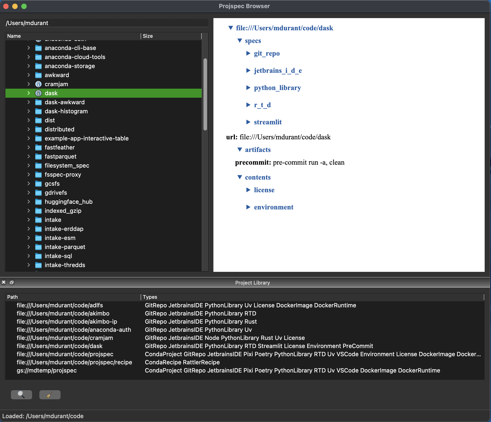

Example Qt integration for projspec
-----------------------------------

Quickly-coded filesystem and library browser. Shows HTML view of project
selected for the current directory or library entry. Selecting a directory
will add if to the library.

A simple search dialog allows you to view only those project types
containing the given class(es).

